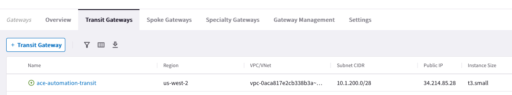
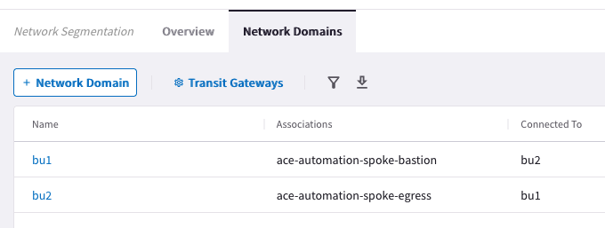

# Overview

In this lab you will simulate the day-to-day operations of your cloud infrastructure built in Lab 1 using the Aviatrix Multicloud Networking and Security platform. You will be conducting all changes on the `Main` branch of your existing repository from Lab 1. We are using the term `Day 1` for the work done in this lab.

This lab is intended to familiarize you with how to change Terraform code and enact those changes against your cloud network infrastructure.

We'll take you through the process of:

1. Modifying gateway instances sizes
2. Modify `Network Segmentation` policies to connect isolated cloud networks.

## Code Modification

It is recommended to use a localized setup with an IDE that integrates with your GitHub account. However, you can also make the code changes directly on the GitHub.com UI.

## Resize gateways

ACE Inc is growing now and needs to resize their gateways. The AWS Transit Gateway is currently t3.micro. Verify this in CoPilot by navigating to `Cloud Fabric-->Gateways-->Transit Gateways`. You may have to toggle on the `Instance Size` column.


ACE needs to resize their AWS gateways from t3.micro to t3.small.

Make this change by editing main.tf file

On GitHub.com cloud UI, click the Pencil icon to edit directly.


Make the change for the `aws_transit_instance_size` on line 4.


Provide a meaningful commit message at the bottom and click the Commit changes button.


As soon as you commit the changes to a file, it will automatically queue a Terraform Plan. Back in Terraform Cloud, navigate to the Overview tab of your workspace. Depending on how soon you navigate there, you will see blue `Planning` or yellow `Planned`, or brown `Cost Estimated` in the Latest Run pane. From there, click on See details to see the planned run with proposed changes such as this:


Click `Confirm & Apply` and `Confirm Plan` to begin the terraform apply. When it is complete (less than 10 minutes later), the transit gateway in AWS will be t3.small size. Confirm again in CoPilot.



However, `BU1` and `BU2` are still not connected. SSH to `BU1` Bastion and leave a continuous ping session running in a terminal window destined to `BU2` App.

## Configure a Connection Policy

Connect BU1 to BU2 by uncommenting this block of code at the bottom of main.tf.

```hcl
# resource "aviatrix_segmentation_network_domain_connection_policy" "ace_automation" {
#   domain_name_1 = "bu1"
#   domain_name_2 = "bu2"
#   depends_on    = [module.ace_automation]
# }
```

On GitHub.com cloud UI, click the Pencil icon to edit directly.


Remove the preceding `#` on each line (numbers 10-16).

Provide an appropriate description for the change:


Once again, in Terraform Cloud, this will automatically trigger a Plan.


Once the plan is finished, be sure to `Confirm & Apply` and `Confirm Plan`


As soon as the apply is complete (should take less than a minute), confirm the egress and bastion networks are now connected by navigating to `Networking-->Network Segmentation` in the CoPilot UI.


If you click on the `Network Domains` top tab you'll see where this is configured in the UI.



Revisit the terminal window where `BU1` Bastion was attempting to Ping `BU2` App. You should now see the responses.

Also, you should now be able to SSH to `BU2` App from `BU1` Bastion.

## Code Optimization

Take a look at the following block of Terraform code that you just enabled on main.tf:

```hcl
  resource "aviatrix_segmentation_network_domain_connection_policy" "ace_automation" {
    domain_name_1 = "bu1"
    domain_name_2 = "bu2"
    depends_on    = [module.ace_automation]
  }
```

This block can be further optimized. The line beginning with depends_on is an _explicit_ dependency on network domains that were created elsewhere in the code. Instead of `hard-coding` domain_name_1 and domain_name_2 as `bu1` and `bu2` respectively, create _implicit_ dependencies. Modify the code as follows:

```hcl
resource "aviatrix_segmentation_network_domain_connection_policy" "ace_automation" {
  domain_name_1 = module.ace_automation.bu1_network_domain_name
  domain_name_2 = module.ace_automation.bu2_network_domain_name
}
```

Since we now have an _implicit_ dependency, we no longer need to create the _explicit_ dependency via `depends_on` and therefore it had been removed.

When you commit and make the change, you'll notice that it makes no changes to your infrastructure. However, it is better Terraform code because it relies less on manual hard-coded dependencies.


## Observations

As you can see, Terraform is extremely powerful and scalable. With just a few lines of code, you can make a lot of changes. Notice how easy it was to make a change to your infrastructure. It also means you could easily effect your networks with misconfiguration. To mitigate risk, your organization will benefit from having some guard rails, especially in a Production environment.

In Lab 3, we will introduce collaboration with those teams.

When you are ready to begin, click `Lab 3 - Day 2` below.
