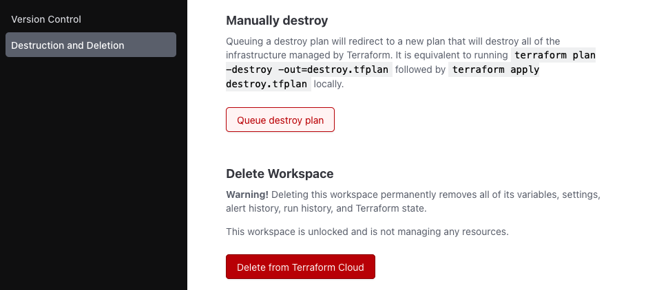

# Cleanup

Avoid excess charges by destroying your environment when done. The sequence is as follows:

## Destroy Lab 3 resources

Visit `Terraform Cloud` > `ace-automation-day-two` workspace > `Settings` menu > `Destruction & Deletion`. Click `Queue Destroy Plan`.

Make sure you confirm the plan to proceed with the equivalent of a terraform destroy. This is sufficient for removing your resources created by `Lab 3`.

When it is complete, you can also delete the Workspace from Terraform Cloud.

This is all documented officially [here](https://learn.hashicorp.com/tutorials/terraform/cloud-destroy).

## Destroy Lab 1 and Lab 2 resources

Recall that Lab 1 and Lab 2 share the same Terraform state in the same Terraform Cloud Workspace. The process of Lab 1 and Lab 2 cleanup is identical to the process for Lab 3.

Visit `Terraform Cloud` > `ace-automation` workspace > `Settings` menu > `Destruction & Deletion` > `Queue Destroy Plan`.

Make sure you confirm the plan to proceed with the equivalent of a terraform destroy. This is sufficient for removing your resources created by Lab 1 and Lab 2.

When it is complete, you can also delete the Workspace from Terraform Cloud. This is all documented officially [here](https://learn.hashicorp.com/tutorials/terraform/cloud-destroy).

## Destroy Controller and CoPilot from Aviatrix Self-service

Destroy the Controller and CoPilot from the Aviatrix Self-Service UI by clicking the `Destroy` icon in the upper-right corner of the tool.

## Delete your GitHub repository

Once you've submitted the requirements for certification and have received confirmation from Aviatrix, you can now delete the repository for `ace-automation` in `GitHub`. Click on Settings and scroll all the way to the bottom to `Danger Zone`. Click `Delete this repository`.

## Next Steps

You should now have a basic understanding of Infrastructure as Code (IaC) concepts and tools for network automation. Your next steps to follow on this learning path at your own pace include:

- Learn git basics. The tutorials on [Atlassian](https://www.atlassian.com/git/tutorials) are some of the best.
- Learn more about GitHub from [this tutorial](https://guides.github.com/activities/hello-world/).
- Learn more about Terraform from the [Hashicorp website](https://learn.hashicorp.com/terraform)
- Visit some of the published [Hashicorp workshops](https://hashicorp.github.io/workshops/)
- Review the Aviatrix [Terraform Provider](https://registry.terraform.io/providers/AviatrixSystems/aviatrix/latest/docs) documentation. **Remember:** Anything that can be configured on the CoPilot UI can be configured via Terraform as well.
