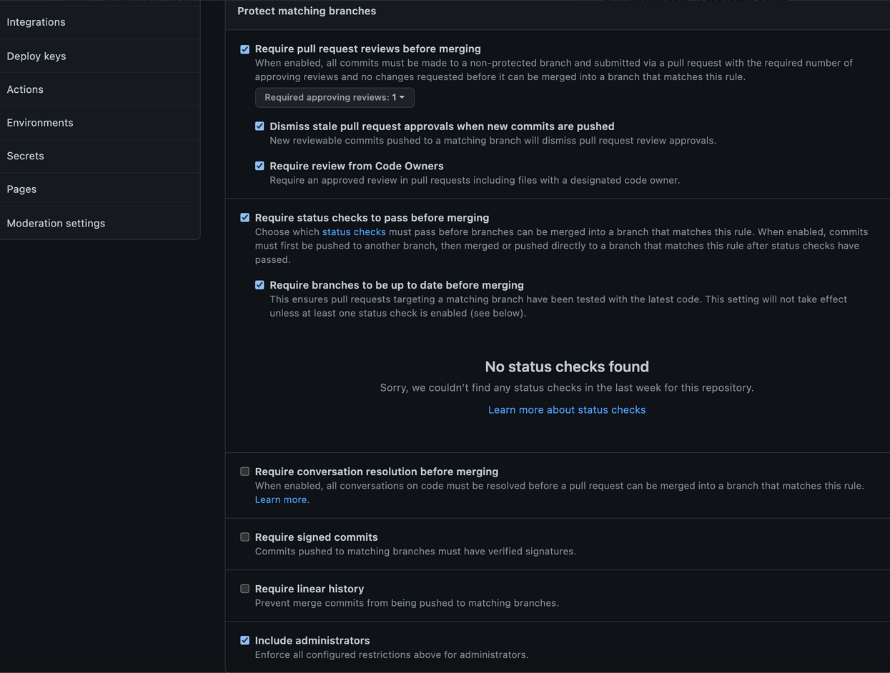
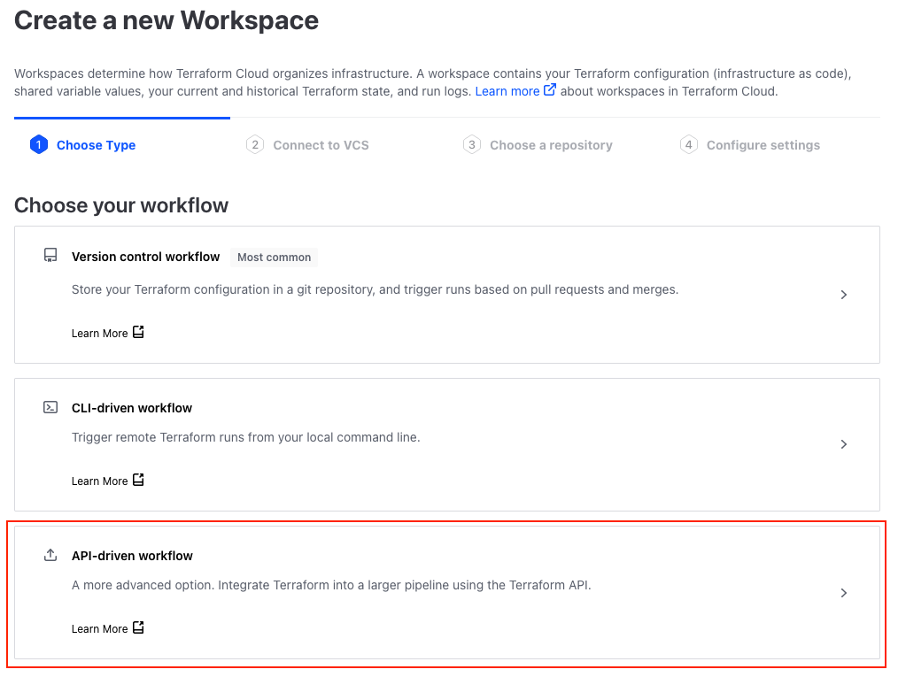
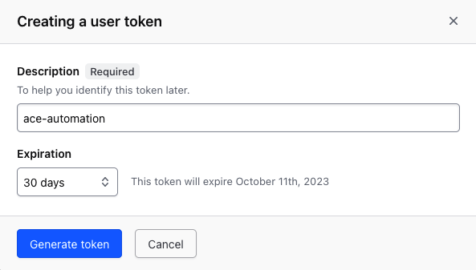
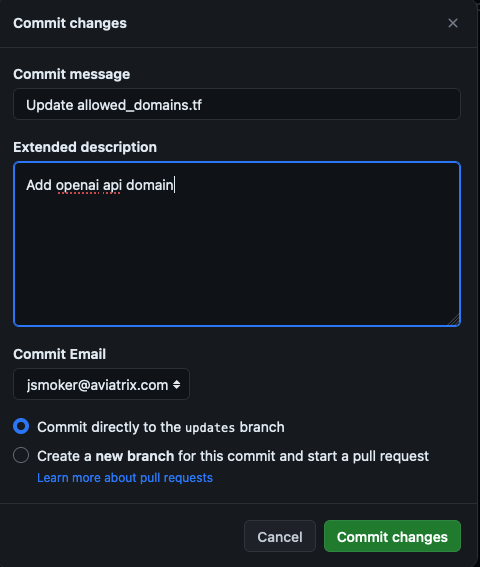
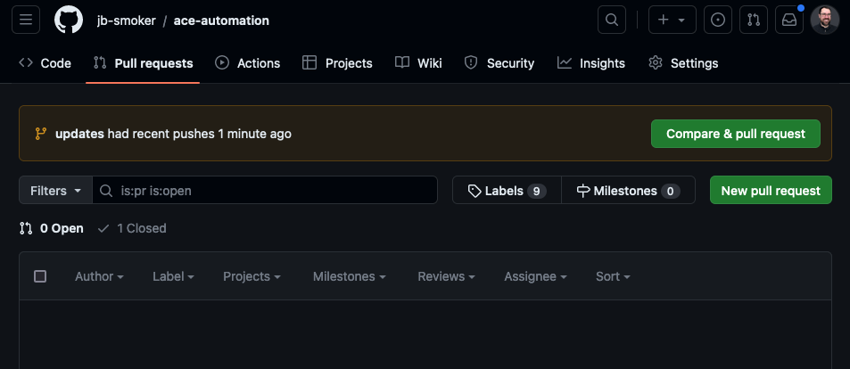

# Overview

In this lab you will adopt a CI/CD pipeline for making secure changes to your cloud infrastructure using the Aviatrix Multicloud Networking and Security platform.

Specifically, you will implement Distributed Cloud Firewall (DCF) for Egress by collaborating with Applications development (DevOps) and InfoSec (SecOps) teams. The Developers will be making changes to a single file whenever they need to make changes to the FQDNs that their app needs to access on the Internet. We are using the term `Day 2` for the work done in this lab.

**Here is an overview of the tasks:**

- Refer to the infrastructure built in Lab 1 and Lab 2.
- Personalize the code for your accounts.
- Create a new GitHub Branch where code changes will be made, and then secure the main branch with Branch Protection Rules.
- Connect GitHub with Terraform Cloud via an API-driven workflow.

You will implement DCF for Egress by collaborating with your DevOps and SecOps teams. The DevOps team will add FQDNs that their app needs to access to the `day-two/main.tf` file in a new GitHub branch. They will then create a `Pull Request` (PR) in GitHub. The `PR` will need to be approved by the SecOps team prior to being merged into the main branch. Branch protection rules enable checks and balances for the organization. Having such guard rails allows for layers of review and approval to help mitigate incorrect configuration entering your cloud networks.

The workflow is represented here.


For the purpose of the lab these personas will be adopted by:

- **DevOps** (You): You will modify code and create a PR, requesting network modifications to the current.
- **SecOps** (Aviatrix): This PR will automatically request Aviatrix review of the changes in the PR. SecOps can approve or suggest modification before approval to the proposed updates.
- **NetOps** (You): With the approval of SecOps, you will now be able to merge the PR and automatically implement the change.

## GitHub

### Code Review

The terraform code for lab 3 is located in the sub-folder `day-two` of the `ace-automation` repository. Let's take a look at each of the files:

- **allowed_domains.tf** - The DevOps team maintains this file. This file defines FQDNs that the app needs to access on the Internet. The DevOps team will know best what domains their app to reach, so they are best positioned to request changes. They will need to make sure the formatting (white space, etc) of each line specifying an FQDN is consistent because GitHub Actions will check this, and fail if the code is not represented in a canonical format. Read [this doc](https://www.terraform.io/docs/cli/commands/fmt.html) for more info on the `terraform fmt` command.
- **main.tf** - This file enables the `Aviatrix Distributed Cloud Firewall` (DCF) and sets webgroups (http and https) that contain domains that are allowed to egress to the Internet. Unless explicitly defined in the `allowed_domains.tf` file, the domain will be blocked. Additionally there is a ruled defined to allow all intra-rfc1918 traffic to traverse. Once DCF is enabled all traffic traversing Aviatrix gateways is blocked unless a rule is defined to allow it.
- **providers.tf** - This file contains the the Aviatrix terraform provider definition.
- **versions.tf** - This file defines the Terraform runtime (aka execution) and State should reside. We are using a Remote Backend in which both of these will reside in a Terraform Cloud workspace. You will need to edit this file appropriately for your tfc org/workspace.

All resources in this repository leverage the Aviatrix terraform provider. In Lab 1 and Lab 2, we defined the controller ip and password in terraform variables. For this lab, we'll be doing the same with environment variables. Both methods are valid.

### Personalize the code for your accounts

Edit `ace-automation/day-two` > `versions.tf` (https://github.com/`[your account]`/ace-automation/blob/main/day-two/versions.tf).

Click the Pencil icon to edit directly on GitHub.com cloud UI


Uncomment this line:

```hcl
# organization = "<replace-with-your-Terraform-Cloud-organization-and-uncomment>"
```

Edit it with the username of your Terraform Cloud organization account.

Commit the changes directly to the main branch.

Next, edit ace-iac-day-two > .github > CODEOWNERS (https://github.com/<student-account>/ace-iac-day-two/blob/main/.github/CODEOWNERS)


Click on the Pencil icon to edit directly on GitHub.com cloud UI


Edit the line for this CODEOWNERS file to specify the ACE SecOps GitHub account as the Owner. For example,

app-fqdn-rules.tf @ace-secops

Edit the other 4 lines and specify the Student’s own GitHub account (NetOps role).

Commit the changes directly to the main branch.

### Invite Collaborators for the Repository

Remember that you are playing the Network Operator role and will need to invite the DevOps and SecOps personas as Collaborators to your Repository.

Click on Settings > Collaborators > Manage access. Make sure these are the Settings for the Repository, not the Settings for your account. 
Click on Invite a collaborator.
Invite your GitHub account that will serve the purpose of the DevOps.
Click on Invite a collaborator again.
Invite your GitHub account that will serve the purpose of SecOps.
Check the email for your respective accounts for DevOps and SecOps and approve the invitations to become a collaborator for your Network Operator Repository.

### Create, Automate, and Secure a Branch

Create a new branch called updates


Automate workflows on the branch by configuring GitHub Actions


Click Actions


Click I understand my workflows, go ahead and enable them

Secure the main branch by creating a Branch Protection Rule. This will ensure that only the GitHub account(s) mentioned in the CODEOWNERS file are authorized to review/approve the Pull Request.

Click on Settings > Branches > Add rule
Name the Branch Name Pattern main
Check the following 7 fields:

Require pull request reviews before merging
Require approvals
Dismiss stale pull request approvals when new commits are pushed
Require review from Code Owners
Require status checks to pass before merging
Require branches to be up to date before merging
Include administrators



By setting this up, you are adding several layers of security to the main branch which is where Terraform will be looking at for terraform apply.

## Terraform Cloud

### Set up workspace

Create a new Workspace.


Select API-driven workflow.



Name the workspace ace-iac-day-two and click Create workspace


### Configure Variables

Navigate to the Variables tab and add these credentials for accessing the Controller as Environment Variables:

AVIATRIX_CONTROLLER_IP
AVIATRIX_USERNAME
AVIATRIX_PASSWORD

Mark the value for AVIATRIX_CONTROLLER_IP and AVIATRIX_PASSWORD as sensitive.

As a learning exercise, note that the credentials for accessing the Aviatrix Controller are defined as Environment variables in this Lab. However, in Lab 1 and Lab 2, the credentials were instead defined as Terraform variables that were called in the provider.tf file. Both methods are valid.


## Connect GitHub Repo and Terraform Cloud via API

Finally, generate an API Token in Terraform Cloud and specify it as a new Secret for your GitHub Repository.

### Terraform Cloud side

Go to the Tokens page in your Terraform Cloud User Settings. Make sure you are in the Settings for your User account (accessible from the upper right corner of the page), not the Settings for your Organization (typically visible in the center of the top menu).


Click on Create an API token and generate an API token named GitHub Actions.



Save the token in a safe place. You will add it to GitHub later as a secret, so the Actions workflow can authenticate to Terraform Cloud.

### GitHub side

Back in GitHub, for the repository (not the user), navigate to Settings > Secrets > Actions.

Create a New repository secret named TF_API_TOKEN, setting the Terraform Cloud API token you created in the previous step as the value.

Now your Terraform Cloud account and the repository in your GitHub account are securely linked via API.

## Collaboration with other stakeholders

### Work done by DevOps team

Please check your work carefully for any errors. If all looks good, navigate to the browser window where you are logged on in GitHub as the DevOps team.

Since Branch Protection Rules are in place for the main branch, make sure you navigate to the updates branch to make any changes. Click on the app-fqdn-rules.tf file in the updates branch to request access to a new FQDN.


Click on the Pencil icon to edit directly on GitHub.com cloud UI


Below the two existing lines for aviatrix, add the following line:

      "*.ubuntu.com"   = "80"

Make sure the formatting (white spaces and alignment) matches the two existing lines. Otherwise, the GitHub Actions check will fail. GitHub Actions is configured for best practices, which is to check for formatting inconsistencies. As an FYI, this file is ace-iac-day-two > .github > workflows > terraform.yml, but it is beyond the scope of this training to go into the configuration and syntax of this file.

Next, click Commit changes:



After the DevOps account makes the code change, they need to create a Pull Request (PR) on the branch. Click New pull request.



Make sure you select the main branch of your repository (NOT the one that you forked) as the base and the updates branch as the compare.


Add relevant comments and then click Create pull request one more time.


GitHub Actions will then automatically do some checks for formatting, and then notify the SecOps GitHub account that their Approval of the PR is pending.


You can click on Details to see the progress at any point.

### Work done by SecOps team

Now you can navigate to the browser window where you are logged on in GitHub as the SecOps team to approve the PR.

Specifically, navigate to Pull requests > Review requests and click on the request.


Click Add your review.


Click Review changes one more time. If you are okay with the changes, click the Approve button and the Submit review.


Once the SecOps team has Approved the PR, it will look like this:


Now, any team can Merge the PR back into the Main branch. Upon doing so, GitHub Actions will trigger a Deployment (CD part of Continuous Deployment), which is a terraform apply and the Network Team can monitor the progress of the apply on Terraform Cloud.

At any time in this workflow, you can see the status of the GitHub Actions by clicking on Actions in GitHub.

On the Controller, you should now see the new rule in your Egress FQDN filter.


## Final Thoughts

Congratulations! You have just built, enhanced, and secured a multicloud network by using automation. By using git branches and enabling collaboration with DevOps and SecOps teams to build CI/CD pipelines with secured branches, you have experienced true NetOps in action. Many of Aviatrix's largest customers practice IaC day in and day out. While the choice of tools (e.g. Jenkins instead of Terraform Cloud, GitLab instead of GitHub) may vary across enterprises, the concepts of Infrastructure as Code remain the same.

Be sure to clean up your resources to avoid any excess charges.
