---
jupytext:
  formats: md:myst
  text_representation:
    extension: .md
    format_name: myst
kernelspec:
  display_name: Terraform
  language: terraform
  name: terraform
---

# Lab 3 - Day 2

## Overview

In this lab you will adopt a CI/CD pipeline for making secure changes to your cloud infrastructure using the Aviatrix Multicloud Networking and Security platform.

Specifically, you will implement Distributed Cloud Firewall (DCF) for Egress by collaborating with Applications development (DevOps) and InfoSec (SecOps) teams. The Developers will be making changes to a single file whenever they need to make changes to the FQDNs that their app needs to access on the Internet. We are using the term `Day 2` for the work done in this lab.

**Here is an overview of the tasks:**

- Refer to the infrastructure built in Lab 1 and Lab 2.
- Personalize the code for your accounts.
- Create a new GitHub Branch where code changes will be made, and then secure the main branch with Branch Protection Rules.
- Connect GitHub with Terraform Cloud via an API-driven workflow.

You will implement DCF for Egress by collaborating with your DevOps and SecOps teams. The DevOps team will add FQDNs that their app needs to access to the `day-two/main.tf` file in a new GitHub branch. They will then create a `Pull Request` (PR) in GitHub. The `PR` will need to be approved by the SecOps team prior to being merged into the main branch. Branch protection rules enable checks and balances for the organization. Having such guard rails allows for layers of review and approval to help mitigate incorrect configuration entering your cloud networks.

The workflow is represented here.

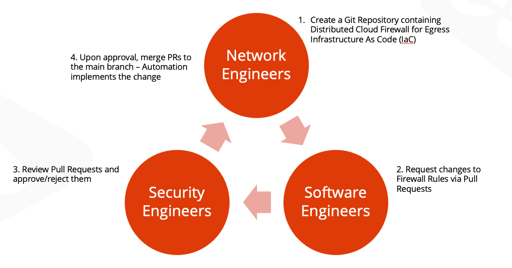

For the purpose of the lab these personas will be adopted by:

- **DevOps** (You): You will modify code and create a PR, requesting network modifications to the current.
- **SecOps** (Aviatrix): This PR will automatically request Aviatrix review of the changes in the PR. SecOps can approve or suggest modification before approval to the proposed updates.
- **NetOps** (You): With the approval of SecOps, you will now be able to merge the PR and automatically implement the change.

## GitHub

### Code Review

The terraform code for lab 3 is located in the sub-folder `day-two` of the `ace-automation` repository. Let's take a look at each of the files:

- **allowed_domains.tf** - The DevOps team maintains this file. This file defines FQDNs that the app needs to access on the Internet. The DevOps team will know best what domains their app to reach, so they are best positioned to request changes. They will need to make sure the formatting (white space, etc) of each line specifying an FQDN is consistent because GitHub Actions will check this, and fail if the code is not represented in a canonical format. Read [this doc](https://www.terraform.io/docs/cli/commands/fmt.html) for more info on the `terraform fmt` command.
- **main.tf** - This file enables the `Aviatrix Distributed Cloud Firewall` (DCF) and sets webgroups (http and https) that contain domains that are allowed to egress to the Internet. Unless explicitly defined in the `allowed_domains.tf` file, the domain will be blocked. Additionally there is a ruled defined to allow all intra-rfc1918 traffic to traverse. Once DCF is enabled all traffic traversing Aviatrix gateways is blocked unless a rule is defined to allow it.
- **providers.tf** - This file contains the the Aviatrix terraform provider definition.
- **versions.tf** - This file defines the Terraform runtime (aka execution) and State should reside. We are using a Remote Backend in which both of these will reside in a Terraform Cloud workspace. You will need to edit this file appropriately for your tfc org/workspace.

All resources in this repository leverage the Aviatrix terraform provider. In Lab 1 and Lab 2, we defined the controller ip and password in terraform variables. For this lab, we'll be doing the same with environment variables. Both methods are valid.

### Personalize the code for your accounts

Edit `ace-automation/day-two` > `versions.tf` (https://github.com/`[your account]`/ace-automation/blob/main/day-two/versions.tf).

Click the Pencil icon to edit directly on GitHub.com cloud UI

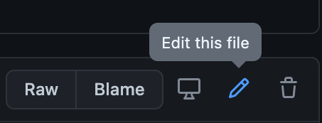

Uncomment this line:

```{code-cell} terraform
# organization = "<replace-with-your-Terraform-Cloud-organization-and-uncomment>"
```

Edit it with the username of your Terraform Cloud organization account.

Commit the changes directly to the main branch.

### Create and enable branch automation

Create two new branches

- updates
- day-zero

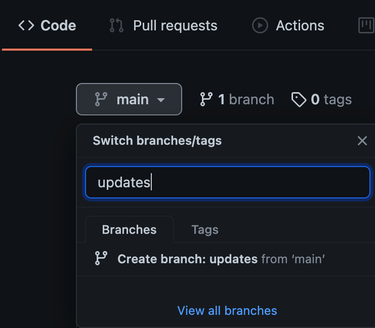

Automate workflows on the branch by configuring GitHub Actions


Click Actions

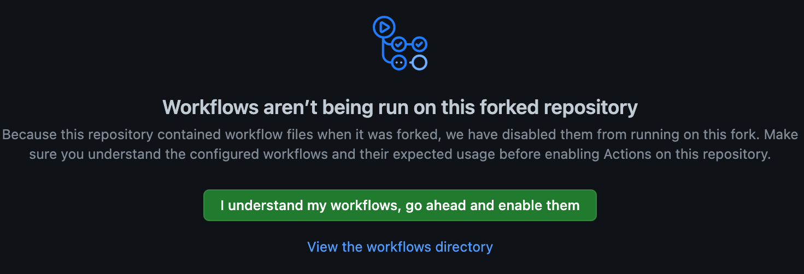

Click "I understand my workflows, go ahead and enable them".

We already have the github actions workflow defined at `ace-automation` > `.github` > `workflows` > `terraform.yml`. This file causes github actions to execute when:

- Pull requests are created with changes in the `day-two` folder, actions will execute `terraform apply` and report the result back to the PR.
- Pull requests are merged to main with changes in the `day-two` folder, actions will execute `terraform apply`

### Codeowners and branch protections

The repository codeowners file and branch protections are the means by which you can enforce responsibility and collaboration between teams.

Consider the scenario for this lab. The development team for ACE, Inc is responsible for applications deployed in the organization. They are best positioned to understand the egress requirements of their applications. We'll have them communicate those changes by modifying the code directly and creating a PR (more on that below). This will automatically trigger a review by the security team to ensure these changes meet corporate standards of appropriateness. Once the security team approves, the network team can now merge the PR and trigger a workflow that implements the change in the network itself. Communication, collaboration, and implementation are all codifed and enforced by the configuration of the repository.

Take a look at the repository codeowners file located at `ace-automation` > `.github` > `CODEOWNERS`


Read the comments for an explanation of this file. We won't be implementing these rules for this lab, but it's important to understand the concept.

You can read more about the codeowners file by clicking [this link](https://docs.github.com/en/repositories/managing-your-repositorys-settings-and-features/customizing-your-repository/about-code-owners).

Next, let's take a look at branch protections and how they work in tandem with the codeowners file to codify responsibility and collaboration.

Go to your repository and click on `Settings` > `Branches` > `Add branch protection rule`

Set the Branch Name Pattern: `main`

Check the following 7 fields (except for require approvals since you're the only one doing the lab):

- Require a pull request before merging
- Require approvals
- Dismiss stale pull request approvals when new commits are pushed
- Require review from Code Owners
- Require status checks to pass before merging
- Require branches to be up to date before merging
- Do not allow bypassing the above settings


Click `Create`

With these protections in place no one person can makes changes to the network. Additionally, for the `allowed_domains.tf` code, the Security team will also need to provide an approval to implement changes.

## Terraform Cloud

For this lab, we no longer want the vcs-driven workspace for lab1 and 2 to execute on changes to the repository. Navigate to the `ace-automation` workspace, click `Settings` then `Version Control`. Change the `VCS` branch to `day-zero`.

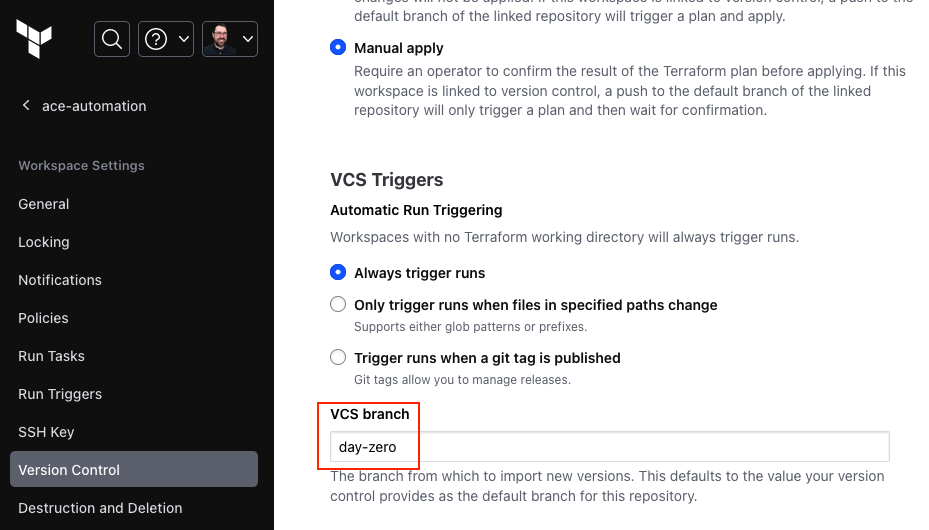

### Set up the day-two workspace

Back at the root of your org's `Projects & workspaces`, create a new workspace by clicking `New`, then `Workspace`.


Select API-driven workflow.


Name the workspace ace-automation-day-two and click Create workspace

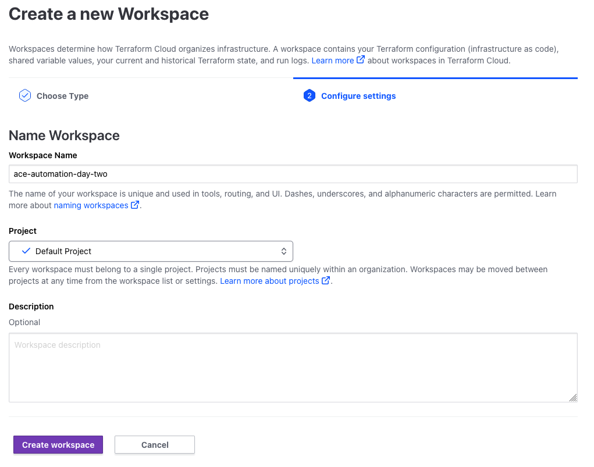

### Configure Variables

Navigate to the Variables section and add these credentials for accessing the Controller as Environment Variables:

- AVIATRIX_CONTROLLER_IP
- AVIATRIX_PASSWORD
- AVIATRIX_USERNAME

Mark the value for `AVIATRIX_CONTROLLER_IP` and `AVIATRIX_PASSWORD` as sensitive.

As a learning exercise, note that the credentials for accessing the Aviatrix Controller are defined as Environment variables in this Lab. However, in Lab 1 and Lab 2, the credentials were instead defined as Terraform variables that were called in the provider.tf file. Both methods are valid.

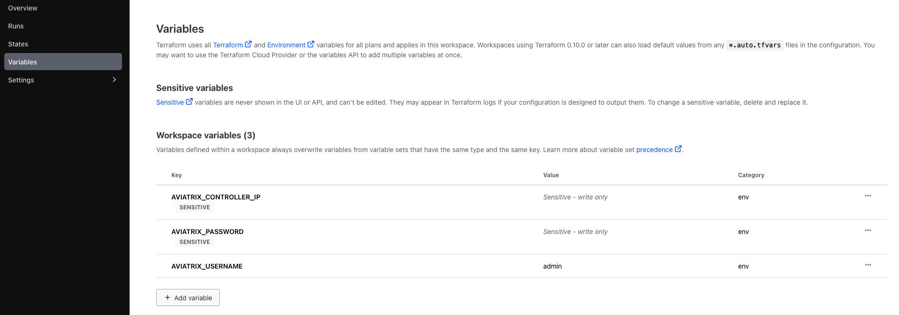

## Connect GitHub Repo and Terraform Cloud via API

Finally, generate an API Token in Terraform Cloud and specify it as a new Secret for your GitHub Repository.

### Terraform Cloud side

Go to the Tokens page in your Terraform Cloud User Settings. Make sure you are in the Settings for your User account (accessible from the upper right corner of the page), not the Settings for your Organization (typically visible in the center of the top menu).


Click on Create an API token and generate an API token named GitHub Actions.


Save the token in a safe place. You will add it to GitHub later as a secret, so the Actions workflow can authenticate to Terraform Cloud.

### GitHub side

Back in GitHub, for the repository (not the user), navigate to `Settings` > `Secrets and variables` > `Actions`.

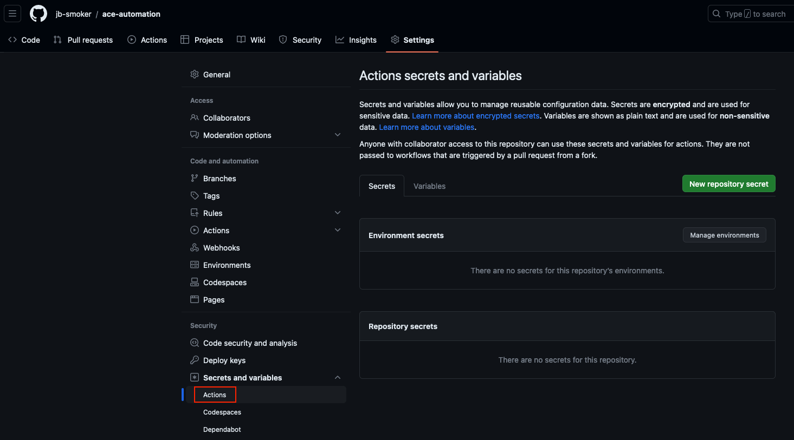

Create a New repository secret named `TF_API_TOKEN`, setting the Terraform Cloud API token you created in the previous step as the value.

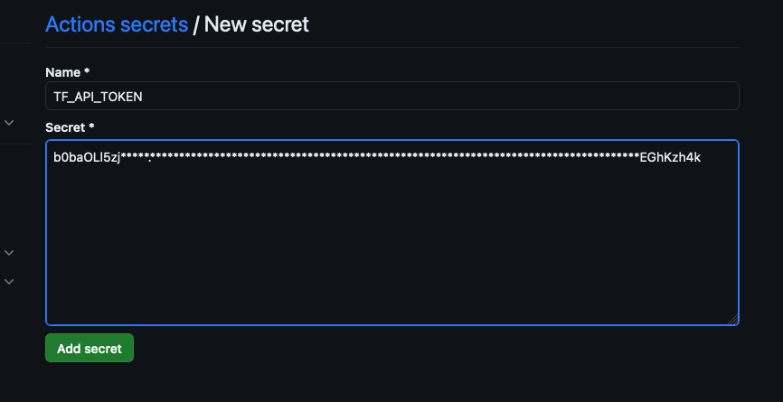

Now your github repository can securely control your terraform cloud workspace via the tfc api.

## Collaboration with other stakeholders

For the remainder of the lab, we're going to be thinking in terms of the personas we've described previously - the DevOps, NetOps, and SecOps teams.

### Work done by the DevOps team

The development team has a new egress requirement to add `ai` integration the their application. They're going to communicate that to the other teams by making the change directly to the code that implements that change in the network.

Make sure you're in the updates branch and select the `day-two/allowed_domains.tf` file.

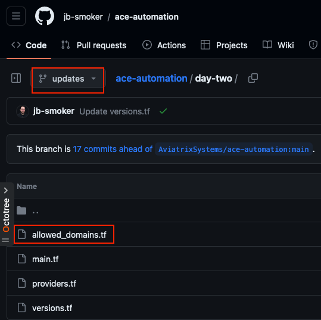

Click on the Pencil icon to edit directly on GitHub.com cloud UI


Below the existing lines for `allowed_https_domains`, add the following line:

```{code-cell} terraform
    "api.openai.com",
```

Make sure the formatting (white spaces and alignment) matches the existing lines. Otherwise, the GitHub Actions check will fail. GitHub Actions is configured for best practices, which is to check for terraform formatting inconsistencies. As an FYI, the configuration for GitHub Actions is `ace-automation-day-two` > `.github` > `workflows` > `terraform.yml`. It is beyond the scope of this training to go into the configuration and syntax of this file.

Next, click Commit changes:


After the DevOps team makes the code change, they need to create a Pull Request (PR) on the branch to request its implementation. Click `Pull requests` and you'll notice there's a banner message prompting to `Compare & pull request`.


For the PR, make sure you select the main branch of your repository (NOT the `AviatrixSystems` repo that you forked) as the base (main) and the updates branch as the compare.

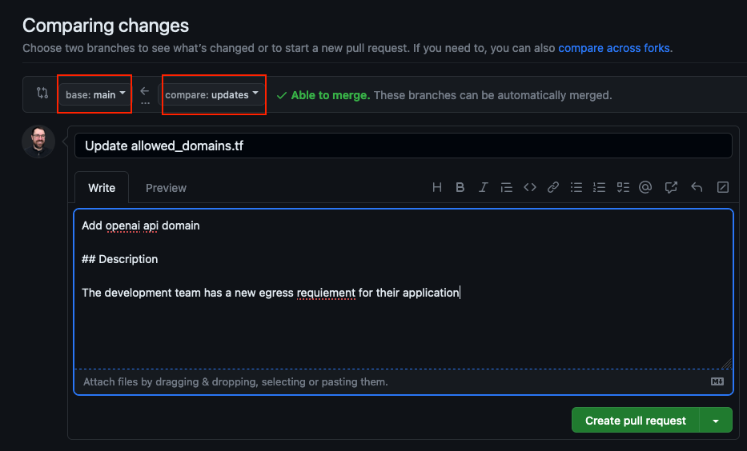

Add relevant comments and then click `Create pull request` one more time.

GitHub Actions will then automatically do some checks for formatting, execute a terraform plan and then update the PR with the results of the plan.

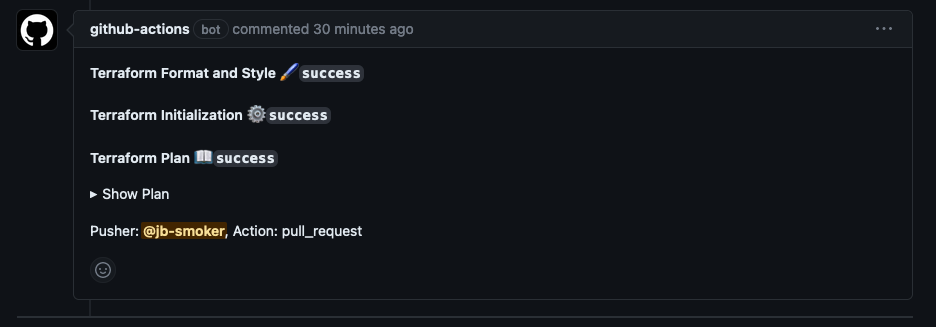

### Work done by the SecOps team

You'll notice that the PR (and the code changes it contains) is now ready to be merged to the main branch.

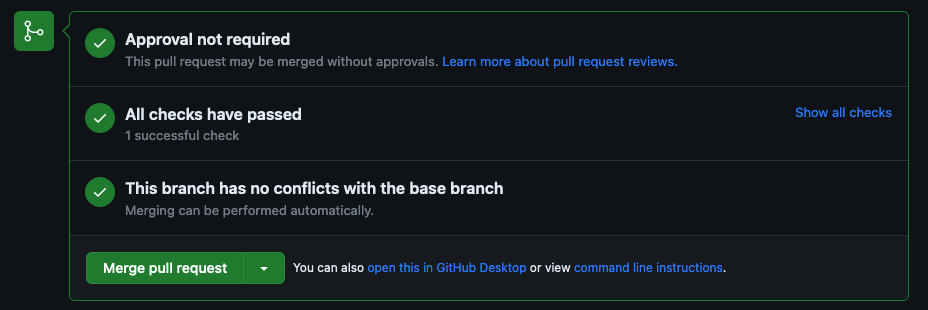

Think back to the `CODEOWNERS` file and branch protections we set. Had we fully enabled these setting to require review and approval by the SecOps team. The `Merge pull request` button would not be enabled and look like this:


The SecOps team would have been alerted that their review was _required_. This gives security the opportunity to deny the change or request changes be made to it before the PR is approved - perhaps the code change doesn't meet organizational standards.

For the sake of this exercise, we'll assume that the changes meet SecOps standards and the PR has been approved. The `Merge pull request` button is enabled, but neither the SecOps or DevOps teams have the permissions required to implement the change.

### Work done by the NetOps team

As the owner of the repository, the `NetOps` team is responsible for merging the PR to the main branch. Doing so will implement changes to the network so there may be timing considerations for doing so. GitHub Actions will trigger a Deployment (CD part of Continuous Deployment), which is a terraform apply and the Network Team can monitor the progress of the apply on Terraform Cloud.

Go ahead and click `Merge pull request` and `Confirm merge` now.

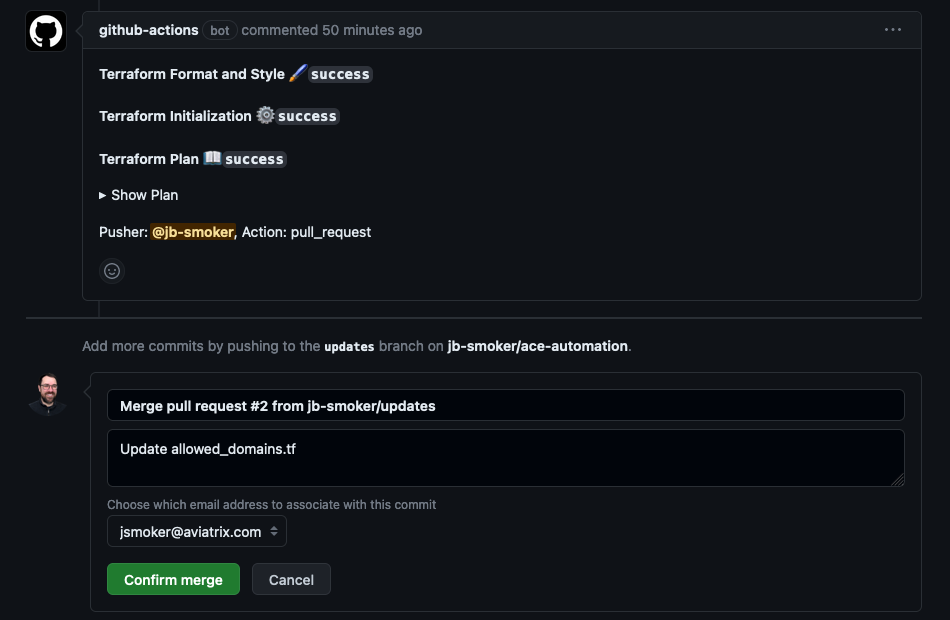

At any time in this workflow, you can see the status of the GitHub Actions by clicking on Actions in GitHub.

You may have noticed from the terraform plan, but this initial merge and terraform apply is doing more than just adding egress access to the domain that was edited. It's also enabling and configuring Aviatrix's [Distributed Cloud Firewall](https://aviatrix.com/distributed-cloud-firewall/)

## Validation

Let's take a look at this in CoPilot. Log in and navigate to `Security-->Distributed Cloud Firewall`

You'll see a base set of rules:

- **default-deny-all** - block anywhere to anywhere across all Aviatrix gateways
- **allow-rfc1918** - however, allow all protocols and ports between rfc1918 (LAN) addresses.
- **allow-internet-http|https** - and allow egress to domains in the configured WebGroups.

Next, click on the `WebGroups` tab and note that `api.openai.com` is configured.

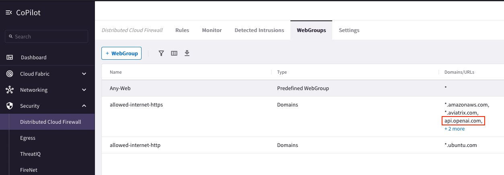

If you'd like, repeat the process and add an additional domain. You could also validate by ssh-ing to your app instance (via the proxy instance) that you built in lab1 and test Internet access via curl/wget.

## Final Thoughts

Congratulations! You have just built, operated, and secured a multicloud network using automation. By using `GitHub Actions` and `Terraform Cloud`, you have experienced true `"GitOps"` in action. You also learned how collaboration between teams can be enabled and enforced through code. No meetings necessary!

Many of Aviatrix's largest customers rely on IaC to ensure their cloud networks are dependable, flexible and auditable. While the choice of tools (e.g. Jenkins instead of Terraform Cloud, GitLab instead of GitHub) may vary across enterprises, the concepts of Infrastructure as Code remain the same.
