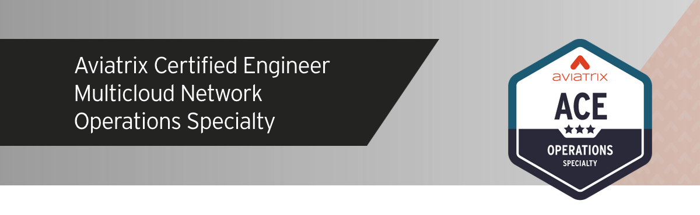
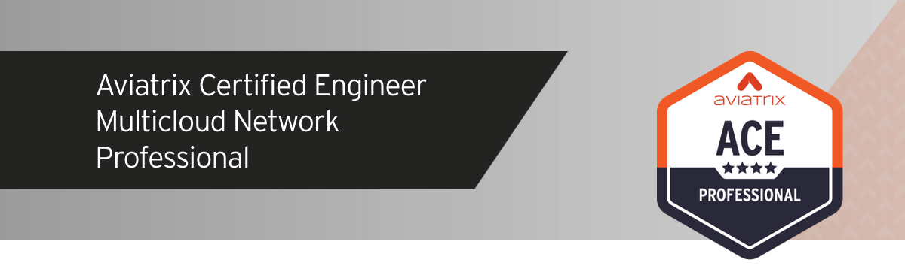

# Summary  

Congratulations! You have just built, operated, and secured a multicloud network using automation. You've role-played development, security, and networking teams in your organization to understand how each can collaborate in a CI/CD pipeline to implement changes to the network in a secure and automated fashion. Many of Aviatrix's largest customers leverage IaC to manage their networks. While the choice of tools (e.g. Jenkins instead of Terraform Cloud, GitLab instead of GitHub) may vary across enterprises, the concepts of Infrastructure as Code remain the same.

Now that you've completed the training, be sure to [clean up your resources](./cleanup.md) to avoid any excess charges.

Also, be sure to check out the advanced courses in the ACE Program, [ACE Operations](https://aviatrix.com/ace-operations/), and [ACE Professional](https://aviatrix.com/ace-professional/).

## About Aviatrix Certified Engineer

The ACE Program is the industry’s first and only multicloud networking certification. Its comprehensive trainings and specialized courses provide a deep understanding of how to build, operate, automate, scale, and secure cloud networks across AWS, Azure, GCP, and OCI. The ACE Program equips participants with best practices that span all major cloud providers, regardless of whether they use Aviatrix secure cloud networking.
